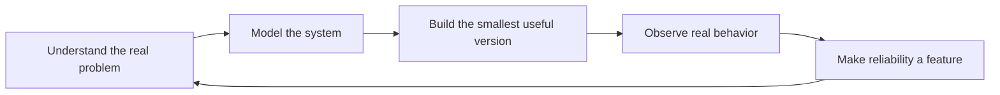

<div align="center">


[](https://git.io/typing-svg)


<br/>


[](https://priyanshhjha.me)
[](https://www.linkedin.com/in/priyansh-jha-489966284/)
[](https://x.com/PriyaanshhJhaa)
[](mailto:Priyanshjhaa17@gmail.com)

</div>

---

## Product Engineering Console

<table>
  <tr>
    <td width="33%" align="center">
      <strong>Product Sense</strong>
      <br/>
      Turning fuzzy ideas into scoped, usable product loops.
      <br/><br/>
      
      
    </td>
    <td width="33%" align="center">
      <strong>System Design</strong>
      <br/>
      Building APIs, data models, queues, and integrations that hold up.
      <br/><br/>
      
      
    </td>
    <td width="33%" align="center">
      <strong>Execution Quality</strong>
      <br/>
      Treating reliability, observability, and polish as product features.
      <br/><br/>
      
      
    </td>
  </tr>
</table>

```text
build profile
├─ ship the product surface
├─ own the backend contract
├─ design the data shape
├─ automate the boring path
└─ make the system understandable
```

---

## I Like Turning This Into That

| Before | What I build | After |
| :--- | :---: | ---: |
| Fragile manual steps | **Execute** | Observable, repeatable workflows |
| A large unfamiliar repository | **CodeMap** | A system you can navigate |
| Proposals, projects, and invoices everywhere | **Axiom** | One connected workspace |
| Endless scrolling for something to watch | **Cinematch** | Discovery shaped around mood |

My work sits where product thinking meets backend engineering. I care about the part users see, but I am most curious about the machinery underneath: execution models, connected data, useful abstractions, and systems that keep working after the demo.

> **NOW:** Building product-grade AI workflows, repository intelligence, and SaaS systems with reliable foundations.

```text
current direction
├── deterministic execution
├── repository intelligence
├── multi-tenant product architecture
└── AI features with reliable foundations
```

---

## The Workshop

<table>
  <tr>
    <td width="50%" valign="top">
      <h3>01 / Execute</h3>
      <strong>A workflow engine for turning intent into reliable execution.</strong>
      <br/><br/>
      Natural-language input is useful only when the system behind it is predictable. Execute focuses on deterministic task routing, queue-based processing, retries, webhooks, and observability.
      <br/><br/>
      <code>workflow engine</code> · <code>async queues</code> · <code>webhooks</code> · <code>observability</code>
      <br/><br/>
      
      
      
      <br/><br/>
      <a href="https://github.com/priyanshjhaa/Execute">
        
      </a>
    </td>
    <td width="50%" valign="top">
      <h3>02 / CodeMap</h3>
      <strong>A map for codebases that have outgrown a quick read-through.</strong>
      <br/><br/>
      CodeMap analyzes repository structure and dependencies, then turns static analysis into a clearer mental model for developers entering unfamiliar systems.
      <br/><br/>
      <code>static analysis</code> · <code>dependency graphs</code> · <code>developer tooling</code>
      <br/><br/>
      
      
      
      <br/><br/>
      <a href="https://github.com/priyanshjhaa/CodeMap">
        
      </a>
    </td>
  </tr>
</table>

<!--
The two cards above intentionally lead with product problems and outcomes.
The repo links remain on the screenshots so the section stays visual without becoming noisy.
-->

<details>
<summary><strong>More things I have shipped</strong></summary>
<br/>

<table>
  <tr>
    <td width="50%" valign="top">
      <a href="https://github.com/priyanshjhaa/Axiom"><strong>Axiom</strong></a>
      <br/><br/>
      A freelancer operating system connecting proposals, project tracking, and invoicing through one multi-tenant data model.
      <br/><br/>
      
      
      
      <br/><br/>
      <a href="https://github.com/priyanshjhaa/Axiom">
        
      </a>
    </td>
    <td width="50%" valign="top">
      <a href="https://github.com/priyanshjhaa/Cinematch25"><strong>Cinematch</strong></a>
      <br/><br/>
      A movie discovery experience built around mood-based recommendations, favorites, and a polished browsing flow.
      <br/><br/>
      
      
      
      <br/><br/>
      <a href="https://github.com/priyanshjhaa/Cinematch25">
        
      </a>
    </td>
  </tr>
</table>

</details>

---

## Stack Texture

<div align="center">


</div>

## How I Build



| Layer | Tools I reach for |
| :--- | :--- |
| Product surface |    |
| Application layer |    |
| Data & state |    |
| Delivery |    |
| Recurring interests | Async systems, webhooks, static analysis, AI integrations |

---

## Build Signals

<div align="center">


</div>

---

<div align="center">

### The Next System

I am looking for an early-stage team where I can own meaningful problems end-to-end, especially around backend systems, developer tools, or AI-powered products.

**[priyanshhjha.me](https://priyanshhjha.me)** · **[start a conversation](mailto:Priyanshjhaa17@gmail.com)**


</div>
