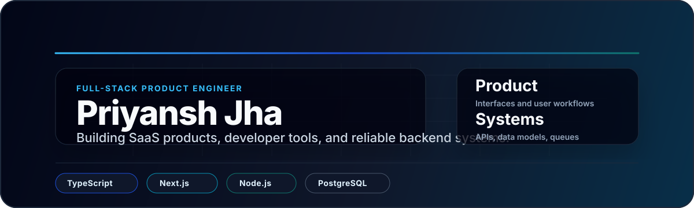
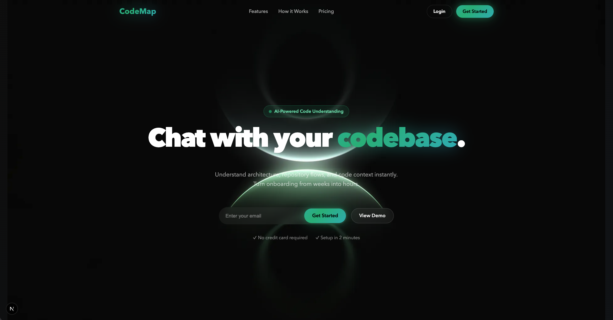
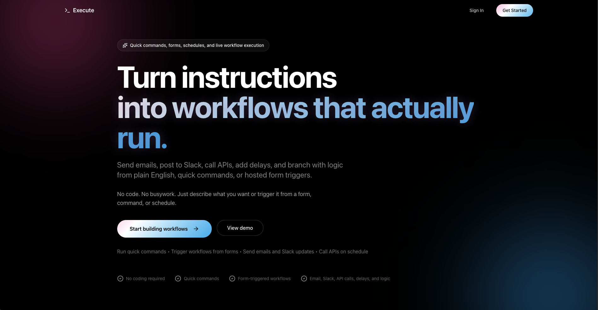
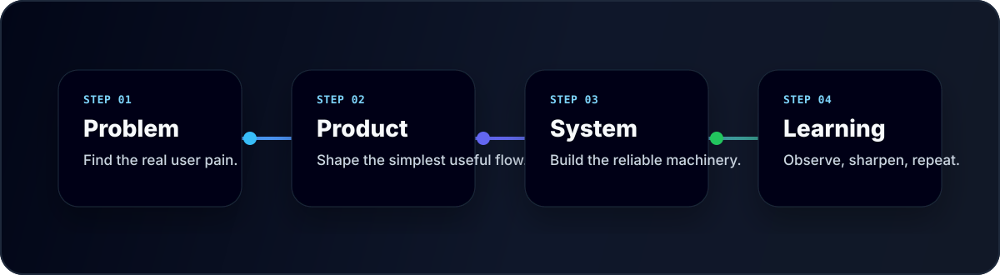

---

## Profile

I am a full-stack engineer with a strong interest in product-oriented engineering: building the interface users interact with, the backend systems that support it, and the technical foundations that keep the product maintainable as it grows.

My work currently centers on developer tools, workflow automation, SaaS products, and AI-assisted experiences. I care about clear product thinking, reliable system design, and practical execution.

---

## Current Focus

| Area | What I am working on |
| :--- | :--- |
| Developer tools | Repository understanding, codebase navigation, static analysis, and developer experience |
| Workflow systems | Background jobs, task routing, retries, webhooks, and operational visibility |
| Product engineering | Interfaces, APIs, data models, authentication, and multi-tenant product flows |
| AI-assisted software | Applying AI where it improves workflows without making the system unpredictable |

---

## Selected Work

<table>
  <tr>
    <td width="50%" valign="top">
      
      <h3>CodeMap</h3>
      
A developer tool for understanding unfamiliar codebases through repository structure, dependency relationships, and clearer navigation paths.

      

        
        
        
      

    </td>
    <td width="50%" valign="top">
      
      <h3>Execute</h3>
      
A workflow execution system focused on reliable task routing, asynchronous processing, retries, webhooks, and observability.

      

        
        
        
      

    </td>
  </tr>
</table>

<strong>Additional Projects</strong>

 

| Project | Description | Technical focus |
| :--- | :--- | :--- |
| [Axiom](https://github.com/priyanshjhaa/Axiom) | A freelancer workspace for proposals, projects, invoicing, and client operations. | Next.js, PostgreSQL, multi-tenant architecture |
| [Cinematch](https://github.com/priyanshjhaa/Cinematch25) | A movie discovery product with mood-based browsing and favorites. | React, Firebase, product UX |

---

## Technical Strengths

| Layer | Focus |
| :--- | :--- |
| Frontend | Product interfaces, dashboards, responsive UI, component-driven development |
| Backend | API design, authentication, job processing, webhooks, service boundaries |
| Data | PostgreSQL schemas, Prisma models, relational data design, multi-tenant patterns |
| Delivery | Dockerized services, Vercel deployments, cloud infrastructure, environment setup |
| Product quality | Reliability, observability, clear user flows, maintainable architecture |

---

## Engineering Approach

| Principle | How it shows up in my work |
| :--- | :--- |
| Start with the product outcome | Define the user workflow before choosing the implementation details. |
| Keep the system understandable | Prefer clear data models, explicit boundaries, and debuggable flows. |
| Design for failure paths | Treat retries, validation, and observability as part of the product. |
| Iterate from real usage | Improve based on feedback, constraints, and what the system reveals after shipping. |

---

### Open to product engineering opportunities

I am interested in teams building SaaS products, developer tools, AI-enabled workflows, and backend-heavy platforms with thoughtful user experiences.

**[Portfolio](https://priyanshhjha.me)** · **[LinkedIn](https://www.linkedin.com/in/priyansh-jha-489966284/)** · **[Email](mailto:Priyanshjhaa17@gmail.com)**

