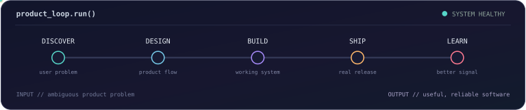

<div align="center">

<samp>PRODUCT ENGINEER // SYSTEM BUILDER // 0→1 SHIPPER</samp>

# Priyansh Jha

### I turn ambitious product ideas into reliable software people can use.



<p>
  <a href="https://priyanshhjha.me"></a>
  <a href="https://www.linkedin.com/in/priyansh-jha-489966284/"></a>
  <a href="https://x.com/PriyaanshhJhaa"></a>
  <a href="mailto:Priyanshjhaa17@gmail.com"></a>
</p>


</div>

---

## `01 / product-to-production`

I work where **product judgment, interface design, and system engineering** overlap. Give me a loosely defined problem and I can shape the workflow, build the product surface, engineer the backend, and take it through deployment.

<table>
  <tr>
    <td width="50%" valign="top">
      <h3>Product + Interface</h3>
      <p>Turn ambiguity into a focused workflow, then build responsive interfaces, dashboards, architecture views, and interaction-heavy tools.</p>
      <p>
        
        
        
      </p>
    </td>
    <td width="50%" valign="top">
      <h3>Backend + Data</h3>
      <p>Design APIs, authentication, relational models, tenant boundaries, queues, webhooks, and background execution around clear contracts.</p>
      <p>
        
        
        
      </p>
    </td>
  </tr>
  <tr>
    <td width="50%" valign="top">
      <h3>AI + Developer Tools</h3>
      <p>Build repository intelligence, retrieval pipelines, agent workflows, and AI features with a specific product job rather than decorative intelligence.</p>
      <p>
        
        
        
      </p>
    </td>
    <td width="50%" valign="top">
      <h3>Reliability + Delivery</h3>
      <p>Make critical flows predictable with validation, approvals, isolation, idempotency, retries, observability, and deliberate state transitions.</p>
      <p>
        
        
        
      </p>
    </td>
  </tr>
</table>

---

## `02 / selected systems`

<table>
  <tr>
    <td colspan="2" valign="top">
      <h3>Atlas · Engineering intelligence before code ships</h3>
      <p>Connects repository structure, architecture, history, and technical knowledge into evidence-backed impact reports and explorable system views.</p>
      <p><strong>I owned:</strong> product direction, interaction design, workspace architecture, authentication, data modeling, and quality checks.</p>
      <p>
        <a href="https://github.com/priyanshjhaa/Atlas"></a>
        
        
        
        
      </p>
    </td>
  </tr>
  <tr>
    <td width="50%" valign="top">
      <h3>CodeMap</h3>
      <p><strong>Understand an unfamiliar codebase faster.</strong></p>
      <p>Imports repositories, builds structured and semantic indexes, visualizes architecture, and answers questions with code-aware retrieval.</p>
      <p>
        <a href="https://code-map-web-sigma.vercel.app"></a>
        <a href="https://github.com/priyanshjhaa/CodeMap"></a>
        
        
      </p>
    </td>
    <td width="50%" valign="top">
      <h3>Execute</h3>
      <p><strong>AI-assisted workflows without invisible mutations.</strong></p>
      <p>Turns natural-language requests into validated proposals, requires explicit approval, and executes observable actions through deterministic workflows.</p>
      <p>
        <a href="https://execute-web-i7u4.vercel.app"></a>
        <a href="https://github.com/priyanshjhaa/Execute"></a>
        
        
      </p>
    </td>
  </tr>
  <tr>
    <td width="50%" valign="top">
      <h3>Axiom</h3>
      <p>A freelancer operations SaaS connecting proposals, projects, invoices, clients, and a shared relational data model.</p>
      <p>
        <a href="https://axiom-nu-six.vercel.app"></a>
        <a href="https://github.com/priyanshjhaa/Axiom"></a>
        
      </p>
    </td>
    <td width="50%" valign="top">
      <h3>Cinematch</h3>
      <p>A content-discovery product with recommendation flows, external APIs, authentication, favorites, and saved content.</p>
      <p>
        <a href="https://cinematch25.vercel.app"></a>
        <a href="https://github.com/priyanshjhaa/Cinematch25"></a>
        
      </p>
    </td>
  </tr>
</table>

---

## `03 / engineering receipts`

<table>
  <tr>
    <td></td>
    <td>Persisted, expiring, and idempotent action proposals before agent mutations.</td>
  </tr>
  <tr>
    <td></td>
    <td>Boundaries across agent tools, execution actions, integrations, and failure findings.</td>
  </tr>
  <tr>
    <td></td>
    <td>Usage accounting, atomic limits, provider controls, and prompt-injection defenses.</td>
  </tr>
  <tr>
    <td></td>
    <td>Semantic repository indexing and evidence-backed software impact analysis.</td>
  </tr>
  <tr>
    <td></td>
    <td>Validated transitions, queues, retries, and visible workflow state.</td>
  </tr>
</table>

---

## `04 / working set`

<div align="center">

[](https://skillicons.dev)

<br>


</div>

```yaml
interface:      TypeScript · React · Next.js · Tailwind CSS · React Flow
system:         Node.js · REST APIs · Webhooks · Queues · Background Jobs
data:           PostgreSQL · Redis · Prisma · Drizzle · Supabase
infrastructure: Docker · AWS · Cloudflare · Vercel · GitHub Actions
default_mode:   understand the problem → ship a useful system → refine with evidence
```

---

## `05 / live signal`


---

<div align="center">

### Have a product that needs thoughtful engineering and decisive execution?

I am open to **remote product engineering roles, internships, early-stage teams, and useful collaborations.**

[](mailto:Priyanshjhaa17@gmail.com)

<br><br>

<samp>product thinking · engineering discipline · shipped outcomes</samp>

</div>
