<div align="center">



<br>

<a href="https://priyanshhjha.me"></a>
<a href="mailto:Priyanshjhaa17@gmail.com"></a>
<a href="https://www.linkedin.com/in/priyansh-jha-489966284/"></a>
<a href="https://x.com/PriyaanshhJhaa"></a>


</div>

---

## BUILDER MODE: ON


I am a full-stack product engineer who moves comfortably between **what should we build?** and **how do we make it dependable?** I turn fuzzy ideas into clear user flows, working interfaces, thoughtful data models, reliable execution paths, and deployed products.

> The job is not finished when the feature works. It is finished when the product makes sense, survives failure, and is useful to someone.


### What I can own

- **Product definition:** turn an ambiguous problem into a focused workflow and a useful first release.
- **Full-stack implementation:** build responsive product surfaces, APIs, authentication, relational data models, and integrations.
- **Complex execution:** design queues, background jobs, webhooks, retries, idempotency, and observable state transitions.
- **Practical AI:** ship agents, retrieval pipelines, and AI-assisted flows with approvals, limits, isolation, and clear UX.
- **Production delivery:** deploy, inspect failure paths, gather real signals, and refine the system with intent.

---

## SHIPPING LOG

### `ATLAS` / Engineering intelligence

**Know what a software change affects before it ships.** Atlas connects code structure, architecture, history, and technical knowledge to create evidence-backed impact reports and explorable system views.


[](https://github.com/priyanshjhaa/Atlas)


---

### `CODEMAP` / Repository intelligence

**Make an unfamiliar codebase understandable.** CodeMap imports repositories, creates structured and semantic indexes, visualizes architecture, and supports code-aware retrieval across large systems.


[](https://code-map-web-sigma.vercel.app)
[](https://github.com/priyanshjhaa/CodeMap)


---

### `EXECUTE` / Safe agent workflows

**Use natural language without surrendering control.** Execute converts requests into validated proposals, requires explicit approval before mutations, and routes approved work through deterministic, observable execution.


[](https://execute-web-i7u4.vercel.app)
[](https://github.com/priyanshjhaa/Execute)


<details>
<summary><strong>More shipped products</strong></summary>
<br>

**Axiom** is a freelancer operations SaaS connecting proposals, projects, invoices, clients, APIs, and one shared relational model.

[](https://axiom-nu-six.vercel.app)
[](https://github.com/priyanshjhaa/Axiom)

**Cinematch** is an API-driven content discovery product with recommendation flows, authentication, favorites, and saved content.

[](https://cinematch25.vercel.app)
[](https://github.com/priyanshjhaa/Cinematch25)

</details>

---

## PRODUCT ENGINEERING, WITH RECEIPTS

```diff
+ approval-gated agent actions with persisted and expiring proposals
+ tenant isolation across tools, integrations, execution, and failures
+ semantic repository indexing and code-aware retrieval pipelines
+ provider controls, usage accounting, atomic limits, and AI safeguards
+ observable workflows with queues, retries, and deliberate transitions
+ product ownership from interaction design to deployed infrastructure
```

---

## THE WORKBENCH

<div align="center">

[](https://skillicons.dev)

<br><br>


</div>

---

<div align="center">

### Have an ambitious product problem?

I am open to remote product engineering roles, internships, early-stage teams, and serious building with curious people.

<a href="mailto:Priyanshjhaa17@gmail.com"></a>

<br><br>

<samp>MAKE IT CLEAR. MAKE IT WORK. MAKE IT MATTER.</samp>

</div>
