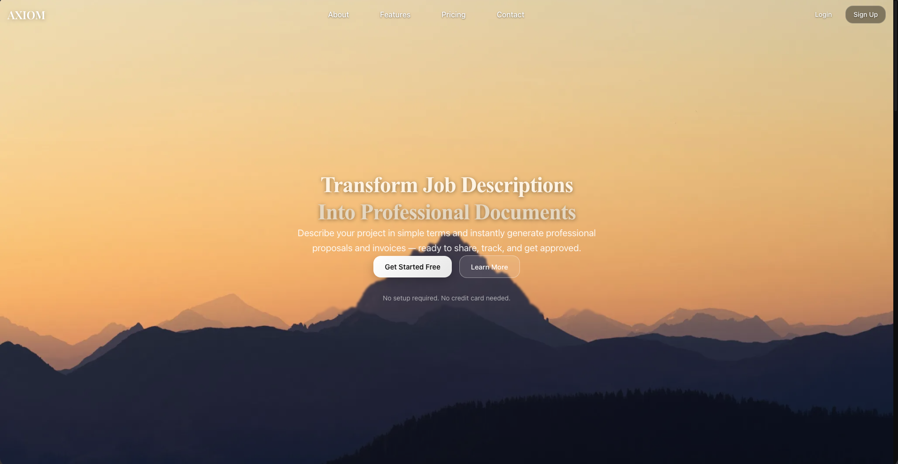
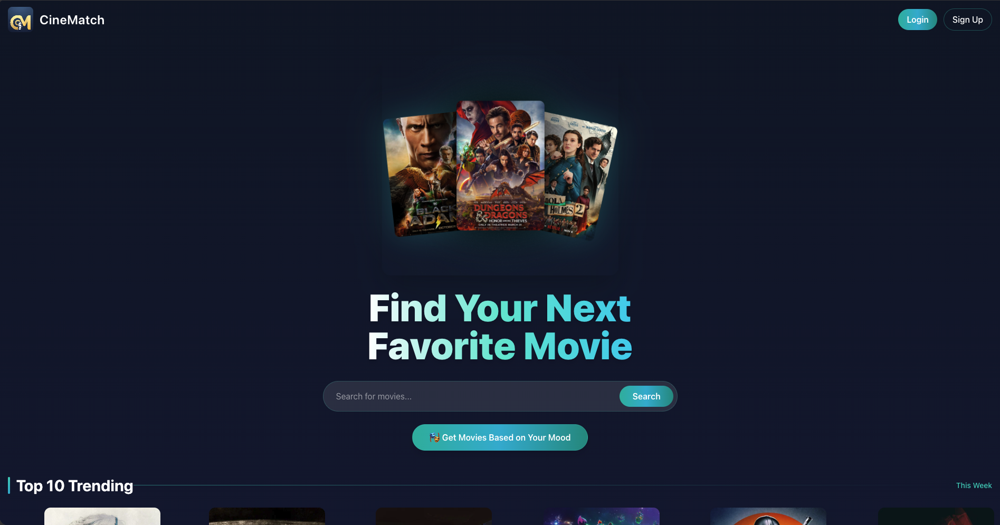
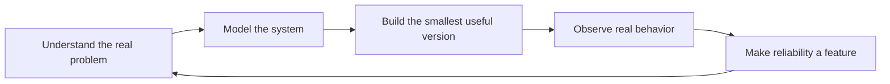

<div align="center">


[](https://git.io/typing-svg)

`full-stack engineer` · `systems thinker` · `CSE + AI/ML`

[Portfolio](https://priyanshhjha.me) · [LinkedIn](https://www.linkedin.com/in/priyansh-jha-489966284/) · [X](https://x.com/PriyaanshhJhaa) · [Email](mailto:Priyanshjhaa17@gmail.com)

</div>

---

## I Like Turning This Into That

| Before | What I build | After |
| :--- | :---: | ---: |
| Fragile manual steps | **Execute** | Observable, repeatable workflows |
| A large unfamiliar repository | **CodeMap** | A system you can navigate |
| Proposals, projects, and invoices everywhere | **Axiom** | One connected workspace |
| Endless scrolling for something to watch | **Cinematch** | Discovery shaped around mood |

My work sits where product thinking meets backend engineering. I care about the part users see, but I am most curious about the machinery underneath: execution models, connected data, useful abstractions, and systems that keep working after the demo.

```text
current direction
├── deterministic execution
├── repository intelligence
├── multi-tenant product architecture
└── AI features with reliable foundations
```

---

## The Workshop

### 01 / Execute

**A workflow engine for turning intent into reliable execution.**

Natural-language input is useful only when the system behind it is predictable. Execute focuses on deterministic task routing, queue-based processing, retries, webhooks, and observability.

`workflow engine` · `async queues` · `webhooks` · `observability`

<a href="https://github.com/priyanshjhaa/Execute">
  
</a>

### 02 / CodeMap

**A map for codebases that have outgrown a quick read-through.**

CodeMap analyzes repository structure and dependencies, then turns static analysis into a clearer mental model for developers entering unfamiliar systems.

`static analysis` · `dependency graphs` · `developer tooling`

<a href="https://github.com/priyanshjhaa/CodeMap">
  
</a>

<details>
<summary><strong>More things I have shipped</strong></summary>
<br/>

<table>
  <tr>
    <td width="50%" valign="top">
      <a href="https://github.com/priyanshjhaa/Axiom"><strong>Axiom</strong></a>
      <br/><br/>
      A freelancer operating system connecting proposals, project tracking, and invoicing through one multi-tenant data model.
      <br/><br/>
      <a href="https://github.com/priyanshjhaa/Axiom">
        
      </a>
    </td>
    <td width="50%" valign="top">
      <a href="https://github.com/priyanshjhaa/Cinematch25"><strong>Cinematch</strong></a>
      <br/><br/>
      A movie discovery experience built around mood-based recommendations, favorites, and a polished browsing flow.
      <br/><br/>
      <a href="https://github.com/priyanshjhaa/Cinematch25">
        
      </a>
    </td>
  </tr>
</table>

</details>

---

## How I Build



| Layer | Tools I reach for |
| :--- | :--- |
| Product surface | React, Next.js, Tailwind CSS |
| Application layer | TypeScript, Node.js, Express, REST APIs |
| Data & state | PostgreSQL, MongoDB, Prisma, Supabase |
| Delivery | Docker, Vercel, AWS, DigitalOcean |
| Recurring interests | Async systems, webhooks, static analysis, AI integrations |

---

## Build Signals

<div align="center">


</div>

---

<div align="center">

### The Next System

I am looking for an early-stage team where I can own meaningful problems end-to-end, especially around backend systems, developer tools, or AI-powered products.

**[priyanshhjha.me](https://priyanshhjha.me)** · **[start a conversation](mailto:Priyanshjhaa17@gmail.com)**


</div>
